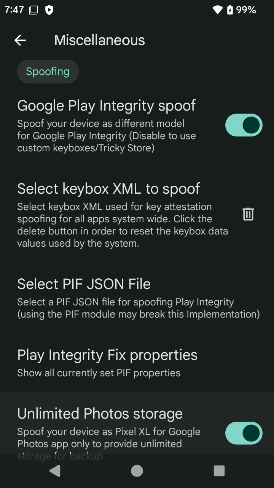

# Matrixx 15 (Android 15) — Xiaomi Redmi 4X (santoni)

> ✅ **The ROM is ready for daily use** — you can flash and use it right now.
>
> ⚠️ **Project Status: Likely Discontinued (Developer's Note)**
>
> From a developer's perspective, the result is not satisfying.
> The Redmi 4X's hardware limitations — 2/3GB RAM, Snapdragon 430 (MSM8937),
> and a legacy 4.9.x kernel — make it extremely difficult to run Android 15
> at the quality standard I want. Google's own minimum specs call for
> 4GB RAM and kernel 5.4+, and every patch or fix on this old vendor/HAL
> tends to introduce new breakage.
>
> It was an awesome 3-day adventure building and debugging this ROM, but
> the performance doesn't match the effort I put in — the hardware simply
> can't keep up with modern Android at this level.
>
> **The latest release (V18 Vanilla) is functional and can be flashed,
> but no further development is planned.**

Unofficial ProjectMatrixx v11.9.0 for santoni.
Optimized for low-RAM devices (2–4GB), SELinux enforcing, Vanilla only.

> **Vanilla only** — no bundled Google Services or microG.
> Use external GApps (NikGapps Core recommended) after flashing.

## Device Specs

| Spec | Detail |
|------|--------|
| SoC | Qualcomm MSM8937 (Snapdragon 430) |
| CPU | 4× A53 @1.4GHz + 4× A53 @1.2GHz |
| GPU | Adreno 505 |
| RAM | 2GB / 3GB (also works on 4GB variants) |
| Kernel | 4.9.257 Luuvy-Checkmate-B.4.0 (prebuilt) |

## Repositories

| Repo | Branch | Path |
|------|--------|------|
| [device_xiaomi_santoni](https://github.com/ziachi/device_xiaomi_santoni/tree/matrixx-15) | `matrixx-15` | `device/xiaomi/santoni` |
| [vendor_xiaomi_santoni](https://github.com/ziachi/vendor_xiaomi_santoni/tree/matrixx-15) | `matrixx-15` | `vendor/xiaomi/santoni` |
| [kernel_xiaomi_msm8937](https://github.com/ziachi/kernel_xiaomi_msm8937/tree/matrixx-15) | `matrixx-15` | `kernel/xiaomi/msm8937` |
| [frameworks_base](https://github.com/ziachi/frameworks_base/tree/15.0) | `15.0` | `frameworks/base` |

> **Note:** `frameworks/base` is a fork of `ProjectMatrixx/frameworks_base` containing
> Spectrum QS tile patches and santoni-specific API fixes.
> To build without custom patches, remove the fork entry from `local_manifests/santoni.xml`.

## Build Instructions

### Prerequisites

- Ubuntu 22.04+ (or WSL2), 16GB+ RAM (22GB recommended), 300GB+ disk
- OpenJDK 11, Python 3.10+, `repo`, `git`, `git-lfs`, `ccache`

```bash
# Install dependencies
sudo apt update && sudo apt install -y \
  bc bison build-essential ccache curl flex g++-multilib gcc-multilib \
  git git-lfs gnupg gperf imagemagick lib32ncurses5-dev lib32readline-dev \
  lib32z1-dev libelf-dev liblz4-tool libncurses5 libncurses5-dev \
  libsdl1.2-dev libssl-dev libxml2 libxml2-utils lzop pngcrush \
  rsync schedtool squashfs-tools xsltproc zip zlib1g-dev openjdk-11-jdk \
  python3 python-is-python3

# Install repo tool
mkdir -p ~/bin
curl https://storage.googleapis.com/git-repo-downloads/repo > ~/bin/repo
chmod a+x ~/bin/repo
export PATH=~/bin:$PATH

# Setup ccache (recommended — cuts rebuild time 80%+)
ccache -M 40G
```

### Build

```bash
# 1. Init source
repo init -u https://github.com/AnierinBliss/matrixx_android.git -b 15.0 --git-lfs --depth=1

# 2. Add local manifest
mkdir -p .repo/local_manifests
curl -o .repo/local_manifests/santoni.xml \
  https://raw.githubusercontent.com/ziachi/device_xiaomi_santoni/matrixx-15/local_manifests/santoni.xml

# 3. Sync
repo sync -c -j$(nproc) --force-sync --no-clone-bundle --no-tags

# 4. Build
source build/envsetup.sh
lunch lineage_santoni-ap4a-userdebug
mka bacon
```

## Features

- **Spectrum Kernel Manager** — 4 CPU/GPU/RAM profiles via QS tile
- **28-app debloat** — ~350MB freed via Android.bp overrides
- **Low-RAM tuning** — aggressive LMK, reduced heap, zRAM, background limits
- **SELinux Enforcing** — targeted vendor policies, no permissive
- **Play Integrity** — passed by default, with built-in spoofing via Matrixx Override
- **USB Debugging** — enabled out of the box for screenless ADB access
- **KernelSU (KSU)** — prebuilt into the kernel, root ready from first boot

### Play Integrity & Matrixx Override

Play Integrity passes out of the box. The ROM includes a built-in feature
called **Matrixx Override** (found in Settings → Miscellaneous) that handles
device spoofing automatically.

If your fingerprint or keybox gets flagged/failed, you can easily replace
them through the Matrixx Override settings — no additional modules or
Magisk/KSU tweaks needed.

**Other Matrixx Override features:**
- Hide app list from detection
- Device spoofing (model, fingerprint, keybox)
- And more — check Settings → Miscellaneous

### USB Debugging

USB Debugging (ADB) is *enabled by default* — only the debugging toggle
is turned on. ADB authorization key security remains fully active, so
unauthorized computers cannot connect without approval.

To use ADB without a screen (headless/screenless access), you need to
inject your ADB public key into the device yourself (e.g. via automation
or recovery). The ROM does not pre-inject any ADB keys.

> ⚠️ **Security note:** Some apps (e.g. banking, e-wallet, certain games)
> may refuse to run or show security warnings when USB Debugging is enabled.
> If you encounter this, disable it manually via Settings → Developer Options
> → USB Debugging.

### KernelSU

KernelSU (KSU) is prebuilt into the Luuvy kernel — root access is available
from first boot. Install the [KowSU Manager APK](https://github.com/nicoway/KowSU/releases)
to manage root permissions.

### Spectrum Profiles

| Profile | Governor | CPU Max | GPU Max | Use Case |
|---------|----------|---------|---------|----------|
| 0 Balance | interactive | 1.4/1.0 GHz | 450 MHz | Daily use (default) |
| 1 Performance | interactive | 1.5/1.2 GHz | 450 MHz | Heavy apps |
| 2 Battery | conservative | 1.0/0.9 GHz | 375 MHz | Max battery life |
| 3 Gaming | performance | 1.5/1.2 GHz | 450 MHz | Locked max clocks |

## Known Issues

### Freezer (cgroup v2) Leak

Android 15 expects the kernel to support cgroup v2 freezer for caching
background apps. Santoni's kernel (4.9.x) only supports cgroup v1 —
there is no way to provide a real cgroup v2 freezer on this kernel.

**What we did:**
- Hardcoded `mUseFreezer = false` in `CachedAppOptimizer.java`
- Forced `Freezer.isFreezerSupported()` to return `false`
- Set `persist.sys.fw.cache_app_freezer=disabled`

**What still happens:**
Despite disabling the core freezer paths, some Android 15 framework
components still attempt to invoke freezer-related calls (e.g.
`Process.setProcessFrozen()`). This causes harmless but noisy logcat
spam from several subsystems. The leak is cosmetic — apps are not
actually frozen and the device runs fine — but the log noise cannot
be fully eliminated without kernel 5.2+ cgroup v2 support.

> **Bottom line:** The freezer spam is a known trade-off of running
> Android 15 on a kernel 4.9 device. It does not affect functionality.

## Troubleshooting

| Problem | Fix |
|---------|-----|
| Settings won't open after format data | Make sure LineageSetupWizard is NOT debloated — it sets provisioning flags |
| `FAILED: vendor_sepolicy.cil.raw` private types | Don't reference `system_suspend` / `storaged` in vendor policy |
| `sepolicy_neverallows` platform_app + vendor prop | Use `persist.sys.*` prefix (system_prop context) |
| webview.apk build error (134 bytes) | `cd external/chromium-webview/prebuilt/arm64 && git lfs pull` |
| Spectrum profile not switching | Properties must use `persist.sys.spectrum.*` (not `persist.spectrum.*`) |
| Dirty flash crash / boot loop | Format data (not just wipe) when major version changes |

## Downloads

[GitHub Releases](https://github.com/ziachi/device_xiaomi_santoni/releases)

## Documentation

| Doc | Description |
|-----|-------------|
| [CHANGELOG.md](CHANGELOG.md) | Full development history (V3-V18) |
| [dontauditlist.txt](dontauditlist.txt) | SELinux dontaudit rule registry |
| [docs/bug-analysis/](docs/bug-analysis/) | Detailed root cause analysis |
| [docs/screenshot/](docs/screenshot/) | Device screenshots |

### Bug Analysis

| File | Topic |
|------|-------|
| [freezer.md](docs/bug-analysis/freezer.md) | Cached app freezer - cgroup v2 vs kernel 4.9 |
| [selinux.md](docs/bug-analysis/selinux.md) | SELinux dontaudit policy - private vs public types |
| [ram-optimization.md](docs/bug-analysis/ram-optimization.md) | ZRAM/LMK/heap/debloat tuning for 2GB |
| [spectrum.md](docs/bug-analysis/spectrum.md) | Kernel profile switcher + property mapping |
| [debloat.md](docs/bug-analysis/debloat.md) | Debloat strategy - what worked, what didn't |
| [luuvy-kernel.md](docs/bug-analysis/luuvy-kernel.md) | Prebuilt kernel integration |

### Screenshots

| Screenshot | Description |
|------------|-------------|
|  | Device info |
|  | Play Integrity passed + 2GB ZRAM |
|  | KernelSU enabled by default |
|  | Spectrum profiles on QS tile |
|  | ROM + NikGapps RAM usage |
|  | Keybox attestation |

## License

This project is licensed under the [Apache License 2.0](LICENSE).

## Credits

- [androidsantoni](https://github.com/androidsantoni) — device tree, vendor, kernel base
- [omansh-krishn](https://github.com/omansh-krishn) — keeping the source alive
- [LineageOS](https://github.com/LineageOS) — original santoni device tree & kernel
- [ProjectMatrixx](https://github.com/ProjectMatrixx) — ROM base

## Maintainer

**@kalomakan / @ziachi**
